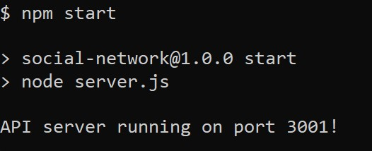
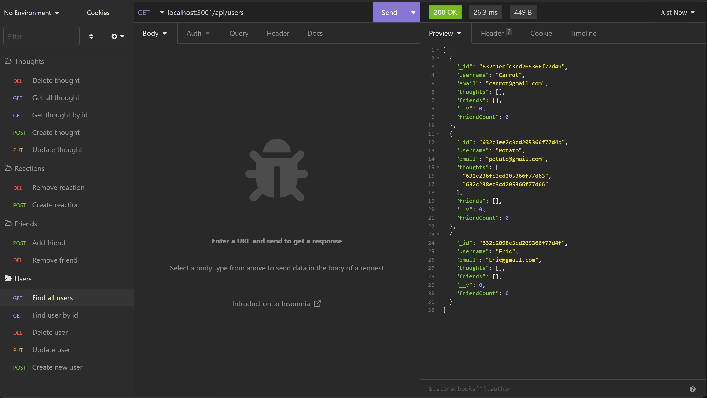

<h1 align="center">Social Network 💬</h1>

    
    
    
    
    </a>

    
    
    
    
    
    
    

    

## Table of Contents

- [Description](#description-🔍)
- [User Story](#user-story-💡)
- [Acceptance Criteria](#acceptance-criteria-🎯)
- [Video Link](#video-link-🎞️)
- [Installation](#installation-💾)
- [Technologies](#technologies-🔧)
- [Usage](#usage-💻)
- [Gif Demo](#Gif-Demo-🎞️)
- [License](#license-©️)
- [Contributing](#contributing-🧩)
- [Questions](#questions-❓)

## Description 🔍

- An application that used mongoose and mongoDB backend for an Social-Network site.

## User Story 💡

- AS A social media startup
- I WANT an API for my social network that uses a NoSQL database
- SO THAT my website can handle large amounts of unstructured data

## Acceptance Criteria 🎯

- GIVEN a social network API
- WHEN I enter the command to invoke the application
- THEN my server is started and the Mongoose models are synced to the MongoDB database
- WHEN I open API GET routes in Insomnia for users and thoughts
- THEN the data for each of these routes is displayed in a formatted JSON
- WHEN I test API POST, PUT, and DELETE routes in Insomnia
- THEN I am able to successfully create, update, and delete users and thoughts in my database
- WHEN I test API POST and DELETE routes in Insomnia
- THEN I am able to successfully create and delete reactions to thoughts and add and remove friends to a user’s friend list

## Video Link 🎞️

## Installation 💾
- Clone the repo and use command `npm install` to install all require packages. 
- Require Insomnia to test the API ability.

## Technologies 🔧
- [JavaScript](https://developer.mozilla.org/en-US/docs/Web/JavaScript)
- [Express.js](https://expressjs.com/)
- [Node.js](https://nodejs.org/en/)
- [MongoDB](https://www.mongodb.com/)
- [Mongoose](https://mongoosejs.com/)
- [Insomnia](https://insomnia.rest/)
- [Moment.js](https://www.npmjs.com/package/moment)

## Usage 💻

1. Input command npm start to start up the server. It will also created a database in mongoDB under the name `socialDB`.

2. When API GET routes for users and thoughts are opened in Insomnia, the data for each of the routes is displayed in formatted JSON.

3. **User**, **Friend**, **Thought**, and **Reaction** routes are created to create the database and test the API on Insomnia.

4. **User Routes** 
- To use `Get, get by ID, create User, update User, and Delete User`, please follow the instruction from the Demo.

5. **Friend Routes** - a user can add a friend and delete a friend.

- To use `add a friend or remove a friend`, please follow the instruction from the Demo.

6. **Thought Routes** - a user can create a thought, get all thoughts or a single thought by ID, update a thought by ID, and delete a thought by ID.

- To use `create, get, get by ID, update, and delete a thought`, please follow the instruction from the Demo.

7. **Reaction Routes** - a user can create a reaction and delete a reaction.

- To use `create or delete a reaction`, please follow the instruction from the Demo.

## Gif Demo 🎞️

## License ©️
✏️ This project is license under MIT

## Contributing 🧩

Please refer to "Fork" or be assigned by Owner.

## Questions ❓

If you have any questions about this project, please contact me directly at ericdoan2008@gmail.com. You can view more of my projects at https://github.com/NguyenDoan85.

## Author 🎊

- This app created by me, please follow my [Github](https://github.com/NguyenDoan85) for more cool app. 
- Here is my [Linkedin](https://www.linkedin.com/in/eric-doan-80547b86/)!